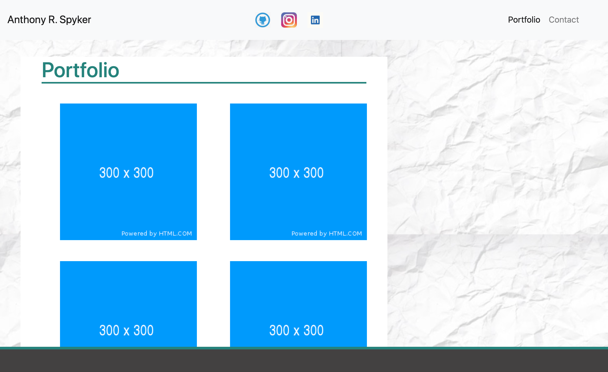
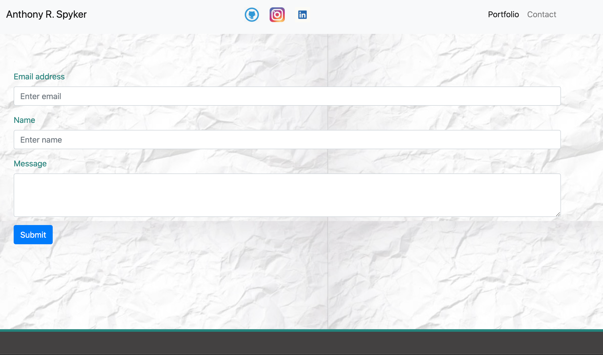

  #Bootstrap_responsive_bio:
  
  Bootstrap_responsive_bio is a fully responsive web site that formats and scales between all screen sizes and platforms, Bootstrap front end styling was utalized to form the web-site.  The page acts as cariculum vita, visual portfolio
and point of reference to contact me directly. 

Contents of Root directory:
  - Project_image folder: contains images used in the project as well as screen shots of pages
  - README.md: full read me text.
  - contact.html: HTML file for the a contact me page.
  - index. html: HTML for the about me page.
  - portfolio.html: a portfolio page with stock image place holders
  - style. css: a css style sheet for all three html files.
  
Basic functions on site:
  - There is a fully operational navigation bar in the header of the page.  
  - The name (my name) on the top left is a link to the opening bio page that acts as a       short bio as well as a curriculum vitae for skills I have aquired over     the years.
  - The Portfolio button links you to the portfolio page.  The images on the page will be screen shots of web-sites developed and will act as liks to those web-   sites.
  - The contact button links to the contact page where visitors will be able to send me messages directly.\
  
 Tools and effects used for site:
  - Bootstrap front end framework was used for most all of the style effects and buttons.
  - Nav bar utility from Bootstrap was used for the nav bar on all pages
  - The contact information bars was also used from Bootstrap styling sheets.

